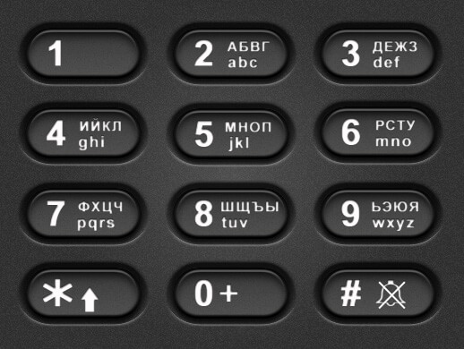

# задача про кнопочный телефон

На вход приходит строка из цифр. Нужно вернуть массив всевозможных комбинаций букв, которые закодированы этими цифрами в соответствии с кнопками телефона. Входная строка состоит из цифр 2-9.

клавиатура: 